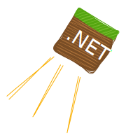
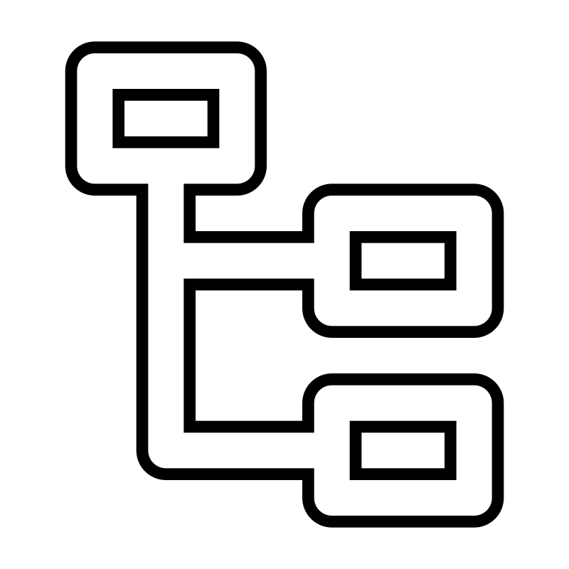

<h1 align="center">
     
   
  
  
</h1>

  <em>
    <b>McProtoNet</b> is a .NET library for working with the Minecraft Java Edition protocol 
    </em>

---

## ⚠️ **Attention**
McProtoNet is currently under active development, so some features are not stable and not all packets are supported.

---

## 🎯 Features

<ul style="list-style-type: none; padding-left: 0;">
    <li>
        
        <strong valign="middle" style="vertical-align: middle">High-performance</strong>
    </li>
    <li>
        
        <strong valign="middle"  style="vertical-align: middle">Async API</strong>
    </li>
    <li>
        
        <strong valign="middle"  style="vertical-align: middle">Multi-Version</strong> (1.12.2-1.21.4)
    </li>
    <li>
        
        <strong valign="middle"  style="vertical-align: middle">NBT Parsing</strong>
    </li>
    <li>
        
        <strong valign="middle" style="vertical-align: middle">Connect to cracked servers</strong>
    </li>

</ul>

## 💸 Support the project

You can support development by donating cryptocurrency:

**USDT (TON)**: `UQB5OyxViBHENXXKPpIZdAXJmrmmqn599_aNkYeRe9HqXY4Q`

**USDT (TRC20)**: `TKbnv1CkfQs1UBSoJVbwuqPAhaHDiy7Vbm`

**BTC**: `bc1qgx4glhjhjyw7sz2qt5mhyg40cspgp8lanpl282`

**ETH**: `0xc657D636f22701E0B4D20B098DFd123450D89518`

